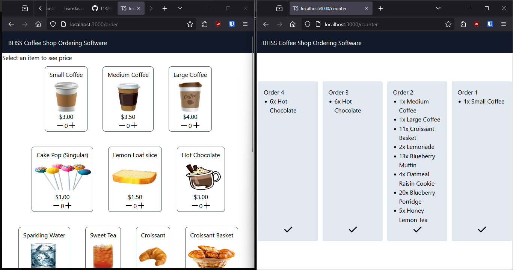

# 2023 Congressional App Challenge Cafe Demo



This repo contains a full stack cafe ordering demo, which features, through the [T3 Stack](https://create.t3.gg), the ability to submit and manage orders of various cafe food items. The entire application was built in 2 hours and 20 minutes (final time: 2:20:32), which explains why the design is laughably horrendous and many of the features do not work. Regardless, it was a fun project that gave me an excuse to practice full stack development without the pressure to write perfect code.

Please remember that this repo is indicative of what I could program in 2 hours, not the typical quality of my codebases. Checkout [my website](https://kennan.tech) for examples of my finer work.

## Development

### Live Server

```shell
yarn

yarn dev
```

### Production

```shell
yarn build

yarn start
```
